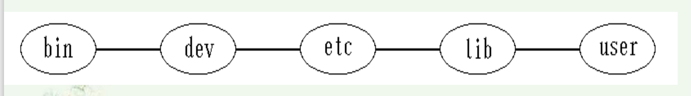
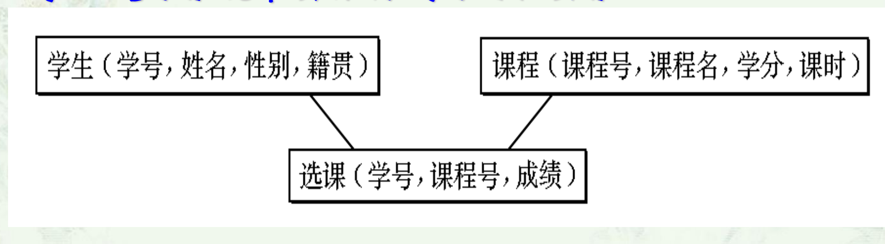
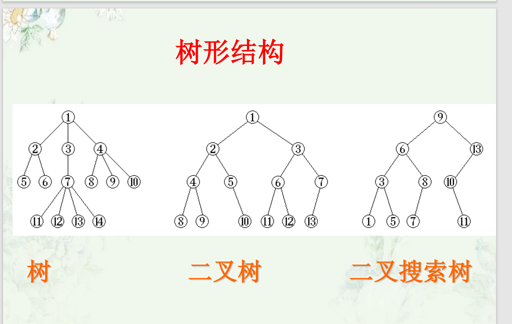
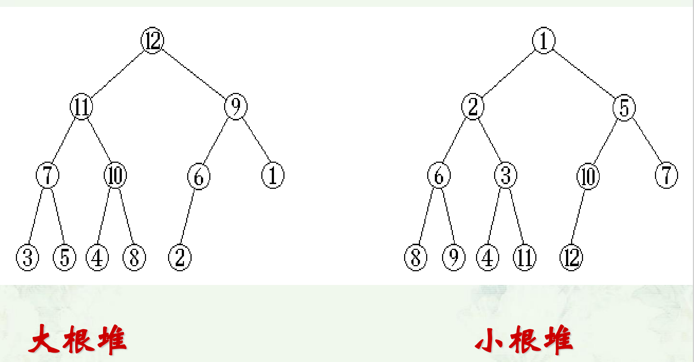
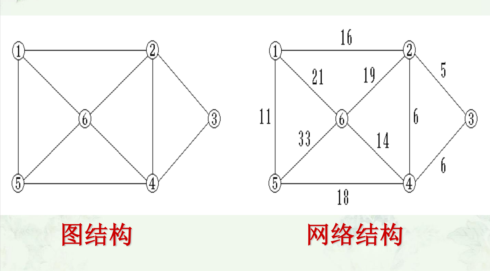
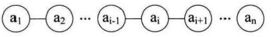
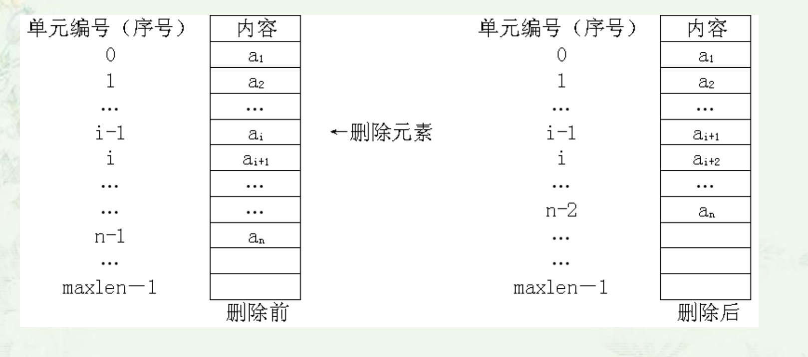
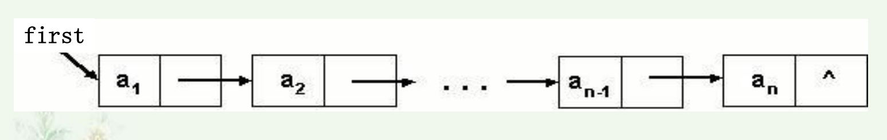

# 数据结构理论笔记

## 第一章

### 线性结构



线性结构中各数据成员之间的线性关系：有直接前驱和直接后继(除最前、最后一个元素)

### 非线性结构



非线性结构中各数据成员之间的没有线性关系：前驱和后继可能多于一个

### 树形结构



### 堆结构



### 图结构和网络结构



### 存储结构

- 顺序存储
- 链式存储
- 索引存储
- 散列存储

## 第二章 线性表

### 线性表

#### 线性表的逻辑特征

- 在非空的线性表，有且仅有一个开始结点a1，它没有直接前趋，而仅有一个直接后继a2 
- 有且仅有一个终端结点an，它没有直接后继，而仅有一个直接前趋an-1 
- 其余的内部结点ai(2≦i≦n-1)都有且仅有一个直接前趋a i-1和一个直接后继a i+1。
- 线性表是一种典型的线性结构

#### 线性表的抽象类

```c++
template <class T >
class LinearList {
public:
 LinearList(); //构造函数
 ～LinearList(); //析构函数
 virtual int Size() const = 0; //求表最大体积
 virtual int Length() const = 0; //求表长度
 virtual int Search(T x) const = 0; //搜索
 virtual int Locate(int i) const = 0; //定位
 virtual T* getData(int i) const = 0; //取值
 virtual void setData(int i, T x) = 0; //赋值 
 virtual bool Insert(int i, T x) = 0; //插入
 virtual bool Remove(int i, T& x) = 0; //删除
 virtual bool IsEmpty() const = 0; //判表空
 virtual bool IsFull() const = 0; //判表满
 virtual void Sort() = 0； //排序
 virtual void input() = 0； //输入
 virtual void output() = 0； //输出
 virtual LinearList<T>operator=
(LinearList<T>& L) = 0; //复制
}
```

#### 线性表的存储结构



1. 顺序存储结构
2. 链式存储结构

#### 线性表的查找

1. 按序号查找
2. 按值查找

#### 线性表的插入

1. 检查线性表是否还有剩余空间可以插入元素，若已满，则进行”溢出“的错误处理
2. 检查i是否满足条件1≤i≤n+1，若不满足， 则进行“位置不合法”的错误处理
3. 将线性表的第i 个元素以及其后面的所有元素均**向后**移动一个位置，以便腾出第i个空位置来存放新元素
4. 将新元素el填入第i个空位置上
5. 把线性表的长度增加1

```c++
//插入算法
template <class T> 
bool SeqList<T>::Insert (int i, T& x) {
	//将新元素x插入到表中第i (1≤i≤n+1) 个表项位置。函数返回插入成功的信息
	if (last == maxSize-1) return false; //表满
	if (i < 1 || i > Length()+1) return false;//参数i不合理
	for (int j = last+1; j >= i; j--) //依次后移
	data[j] = data[j-1];
	data[i-1] = x; //插入(第 i 表项在data[i-1]处)
	last++; 
    return true; //插入成功
}
```

#### 线性表的删除

线性表的删除运算是指将表的第i (1≦i≦n)结点删除，使长度为n的线性表 ：(a1，…a i-1，**ai**， a i+1…，an ) 变成长度为n-1的线性表(a1，…a i-1，a i+1，…，an ) 



删除算法的步骤为：  

1. 检查 i 是否满足条件1≤i≤n，若不满足， 则进行“位置不合法”的错误处理
2. 将线性表中的第 i 个元素后面的所有元素均向前移动一个位置
3. 把线性表的长度减少1

```c++
//删除算法
template <class T>
bool SeqList<T>::Remove (int i, T& x) {
	//从表中删除第 i (1≤i≤n) 个表项，通过引用型参数 x 返回被删元素。函数返回删除成功信息
	if (last == -1) return false; //表空
	if (i < 1 || i > last+1) return false; //参数i不合理
	x = data[i-1]; 
	for (int j = i; j <= last; j++) //依次前移，填补
	data[j-1] = data[j];
	last--; 
    return true; 
}
```

### 顺序表

#### 顺序表的定义

用一组地址连续的存储单元（如数组）依次存储线性表的数据元素，这种存储结构的线性表称为顺序表。

#### 顺序表的抽象类

```c++
template class<T>
SeqList
{
public:
  SeqList(int sz = defaultSize);          // 构造函数
  SeqList(SeqList<T> &L);                 // 复制构造函数
  ～SeqList() { delete[] data; }          // 析构函数
  int Size() const { return maxSize; }    // 求表最大容量
  int Length() const { return last + 1; } // 计算表长度
  int Search(T &x) const;
  // 搜索x在表中位置，函数返回表项序号
  int Locate(int i) const;
  // 定位第 i 个表项，函数返回表项序号
  bool getData(int i, T &x); // 取第i个元素
  bool Insert(int i, T &x);  // 插入
  bool Remove(int i, T &x);  // 删除
  ……
};

```

#### 顺序表的应用：集合的“并”运算

思路：

遍历顺序表LA的所有元素，在顺序表LB中搜索是否存在该元素（复杂度为O(n)的搜索），若不存在则添加到LB中

```c++
void Union(SeqList<int> &LA,SeqList<int> &LB)
{
  int n1 = LA.Length(), n2 = LB.Length();
  int i, k, x;
  for (i = 1; i <= n2; i++)
  {
    LB.getData(i, x); // 在LB中取一元素
    k = LA.Search(x); // 在LA中搜索它
    if (k == 0)       // 若在LA中未找到插入它
    {
      LA.Insert(n1 + 1, x);
      n1++;
    }
    // 插入到第n个表项位置
  }
}
```

#### 顺序表的应用：集合的“交”运算

思路：

遍历顺序表LA的所有元素，若该元素未在LB中找到，则在LA中删除该元素。

```c++
void Intersection(SeqList<int> &LA,SeqList<int> &LB)
{
  int n1 = LA.Length();
  int x, k, i = 1;
  while (i <= n1)
  {
    LA.getData(i, x); // 在LA中取一元素
    k = LB.Search(x); // 在LB中搜索它
    if (k == 0)       // 若在LB中未找到
    {
      LA.Remove(i, x);
      n1--;
    } // 在LA中删除它
    else
      i++; // 未找到在A中删除它
  }
}
```

#### 顺序表的优缺点

**顺序表的优点：**

1. 无须为表示节点间的逻辑关系而增加额外的存储空间（不需要额外的指针或链接信息，因此不会增加额外的存储开销）
2. 可以方便的随机存取表中的任一节点

**顺序表的缺点：**

1. 插入和删除运算不方便 
2. 由于要求占用连续的存储空间，存储分配只能预先进行

### 单链表 (Singly Linked List)

#### 线性结构

1. 结点之间可以连续，可以不连续存储 
2. 结点的逻辑顺序与物理顺序可以不一致
3. 表可扩充

#### 单链表类的定义

```c++
class List {
//链表类, 直接使用链表结点类的数据和操作
private:
    LinkNode *first; //表头指针
	……
public:
	……
}; 
```

#### 与链表有关的基本操作   

1. 结点指针的定义： `LinkNode *p`

2. 结点存储空间的申请 ：

   new 方法   `p=new LinkNode ( )`

3. 空间的释放：

   delete方法   `delete p`

4. 结点中域的访问：

   `p->data=x;`  

   `p->link=q; (q是结点指针)`

5. 空指针NULL或0：

   `p->link=0;` 

   `q=0;`

#### 单链表的建立

##### 1、头插入建表 



​		从一个空表开始，重复读入数据，生成新结点，将读入数据存放到新结点的数据域中， 然后将新结点插入到当前链表的表头上，直到读入结束为止。

```c++
template <class T>
List<T>::HLinkList(int n)
{
  first = 0;
  for (i = 0; i < n; i++)
  {
    p = new LinkNode<T>();
    cin >> p-> data;
    p-> link = first;
    first = p;
  }
}
```

##### 2、尾插入建表

​		**头插法**建立链表虽然算法简单，但**生成的链表中结点的次序和输入的顺序相反**。

​		若希望**二者次序一致**，可采用**尾插法**建表。